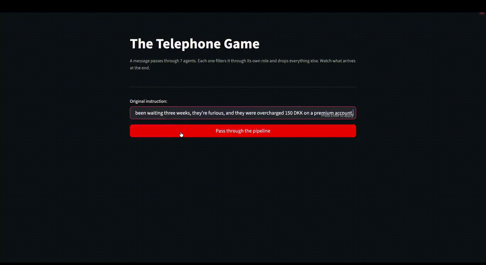

# Agents Taking Irreversible Actions — Experiment

An experiment demonstrating what happens when an AI agent receives ambiguous business instructions and has access to irreversible tools and how a human-in-the-loop confirmation layer fixes it.

## Setup

```bash
pip install -r requirements.txt
```

Create a `.env` file:

```
OPEN_AI_KEY=your_openai_key_here
```

## Usage

### The Telephone Game

A message passes through 7 agents in sequence. Each one filters it through its own role and drops everything else. Watch how much context survives to the end.

```bash
streamlit run telephone.py
```

### HITL Experiment (Streamlit)

Side-by-side comparison of an agent with and without a human-in-the-loop confirmation layer. Run in a browser with an interactive approval UI.

```bash
streamlit run experiment_streamlit.py
```

